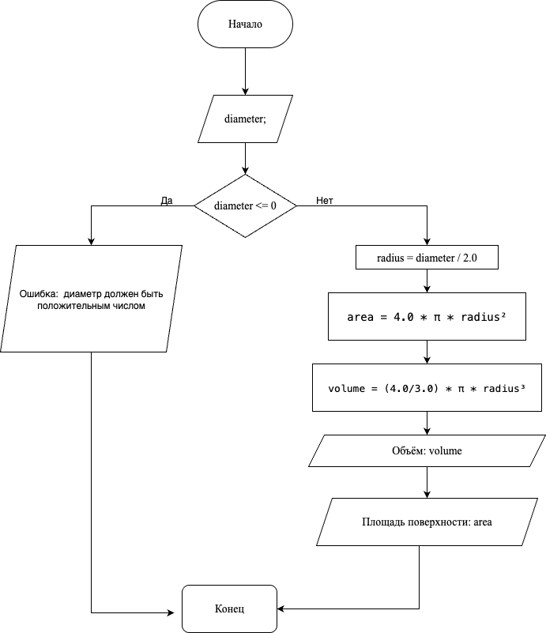

# Домашнее задание к работе 2

## Условие задачи
Написать и отладить программу вычисления площади
поверхности и объема шара по заданному значению оси (диаметру)
---

## 1. Алгоритм и блок-схема

### Алгоритм
1. Начало
2. Объявление константы:
    - `PI - число Пи, математическая постоянная, равная отношению длины окружности к её диаметру`
3. Ввод значения диаметра:
    - `diameter - диаметр шара`
4. Проверка на корректность введённых данных (диаметра шара)
5. Вычисление радиус шара: `radius` = `diameter` / 2.0
6. Вычисление площадь поверхности шара: `area` = 4.0 * `PI` * (`radius` * `radius`)
7. Вычисление объём шара: `volume` = (4.0 / 3.0) * `PI` * (`radius` * `radius` * `radius`)
8. Вывод результата расчетов с подстановкой всех значений в текст.
9. Конец
### Блок-схема
 

---

## 2. Реализация программы

```c
#include <stdio.h>
#include <locale.h>

int main() {
    setlocale(LC_ALL, "RUS");
    float diameter;
    float radius;
    float area;
    float volume;
    const double PI = 3.14;

    printf("Введите диаметр шара: ");
    scanf("%f", &diameter);

    if (diameter <= 0) {
        printf("Ошибка: диаметр должен быть положительным числом\n");
        return 1;
    }

    radius = diameter / 2.0;

    area = 4.0 * PI * (radius * radius);

    volume = (4.0 / 3.0) * PI * (radius * radius * radius);
    printf("Исходные параметры:\n");
    printf("\tДиаметр шара: %.3f\n", diameter);
    printf("Решение:\n");
    printf("\tРадиус шара: %.3f / 2 = %.3f\n",diameter, radius);
    printf("\tПлощадь поверхности: 4 * %.3f * (%.3f)^2 = %.3f\n",PI,radius, area);
    printf("\tОбъем: 4/3 * %.3f * (%.3f)^3 = %.3f\n",PI,radius, volume);

    return 0;
}
```
# 3. Результаты работы программы
```bash
Введите диаметр шара: 20
Исходные параметры:
    Диаметр шара: 20.000
Решение:
    Радиус шара: 20.000 / 2 = 10.000
    Площадь поверхности: 4 * 3.140 * (10.000)^2 = 1256.000
    Объем: 4/3 * 3.140 * (10.000)^3 = 4186.667
```
# 4. Результаты работы программы
#### Сафонов Павел Романович бИПТ-251